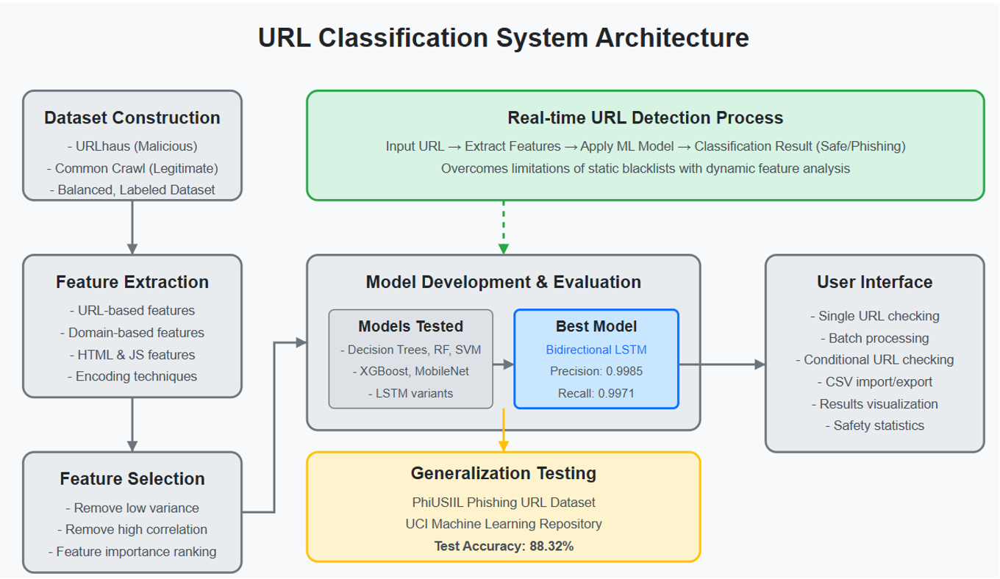

# URL Classification System 🔗🛡️  
Real‑time detection of malicious (phishing) URLs using classical ML and deep‑learning models with a Flask REST API and a lightweight web UI.

---

## 1. Project Motivation
Browser black‑lists are purely reactive and miss brand‑new (“zero‑day”) phishing pages.  
This project builds a **feature‑driven, model‑based** alternative that learns patterns of malicious behaviour and flags dangerous links on the fly.

<div align="center">
  
</div>

*Figure 1 – High‑level architecture. A bidirectional LSTM is the production model. Classical ML baselines and CNN variants are provided for comparison.*

---

## 2. Repository Layout
```

url\_classification\_system/
├── data/                          # Final balanced dataset (CSV) & feature matrices
├── docs/                          # Explanatory figures (architecture.png, …)
├── src/
│   ├── Dataset\_construction/      # Scripts that build the dataset from raw feeds
│   ├── Feature\_engineering/       # URL, domain & content feature extraction + selection
│   ├── Models\_and\_evaluations/
│   │   ├── Machine\_Learning/      # Tree, RF, SVM, XGBoost baselines
│   │   ├── CNN/                   # Character‑level CNN & MobileNet‑V2
│   │   └── LSTM/                  # Bidirectional LSTM (production) + trainers
│   └── User\_interface/
│       ├── back-end code/         # Flask REST API for real‑time inference
│       └── front-end code/        # Vite + Vue 3 dashboard (single & batch check)
├── requirements.txt               # Core Python deps (see §4)
└── LICENSE (MIT)                  # Change if needed

````

---

## 3. Data Pipeline

| Stage | Source / Method | Key Points |
|-------|-----------------|------------|
| **Malicious URLs** | [URLhaus](https://urlhaus.abuse.ch/) daily feed | ~265 k samples |
| **Legitimate URLs** | [Common Crawl CDX](https://commoncrawl.org) snapshot | Randomly sampled to balance classes |
| **Feature Extraction** | 30 + handcrafted features <br>– URL / lexical <br>– Domain / DNS <br>– HTML & JS hints | Implemented in `feature_extraction_segment.py` |
| **Feature Selection** | Low‑variance pruning, Pearson/Spearman correlation, RF importance | `feature_selection.py` |
| **Train/Test Split** | 80 % stratified train (internal), 20 % hold‑out + **PhiUSIIL** external test | Ensures generalisation |

The prepared dataset (`data/final_dataset_with_selected_features.csv`) is shipped for convenience.  
To rebuild from scratch:

```bash
python src/Dataset_construction/generate_dataset.py           # raw → balanced CSV
python src/Feature_engineering/feature_extraction_segment.py  # feature matrix
python src/Feature_engineering/feature_selection.py           # reduced feature set
````

---

## 4. Environment & Installation

> **Python 3.10+** (tested) & **Node 18+** for the optional web dashboard.

### 4.1  Create a virtualenv and install Python dependencies

```bash
git clone https://github.com/Cjj040721/url_classification_system.git
cd url_classification_system
python -m venv .venv && source .venv/bin/activate
pip install -r requirements.txt
# Deep‑learning extras
pip install torch==2.3.0 torchvision==0.18.0 --index-url https://download.pytorch.org/whl/cu121
pip install flask flask_cors
```

> **Note** – GPU acceleration is optional but strongly recommended for (re)training.

### 4.2  Front‑end (dashboard) – *OPTIONAL*

```bash
cd src/User_interface/front-end\ code
npm ci            # or `npm install`  
npm run dev       # hot‑reload @ http://localhost:5173
```

---

## 5. Training & Evaluation

| Model                    | Precision  | Recall     | F1     | ROC‑AUC | Internal Test set |
| ------------------------ | ---------- | ---------- | ------ | ------- | ----------------- |
| **Bi‑LSTM (Production)** | **0.9985** | **0.9971** | 0.9978 | 0.9991  | 25 k URLs         |
| Random Forest            | 0.976      | 0.973      | 0.974  | 0.987   | –                 |
| MobileNet‑V2             | 0.981      | 0.979      | 0.980  | 0.992   | –                 |

**External generalisation** (PhiUSIIL dataset, unseen domains): **88.32 % accuracy** – see `generalisation_testing.ipynb`.

To reproduce the main model:

```bash
python src/Models_and_evaluations/LSTM/lstm_train_v2.py \
       --epochs 30 --batch_size 256 --lr 1e-3 --kfold 5
```

Trained weights are saved under:

```
src/Models_and_evaluations/LSTM/lstm_train_v2/best_fold*.joblib
```

---

## 6. Running the Real‑Time API

```bash
cd src/User_interface/back-end\ code
python main.py            # defaults to http://0.0.0.0:5000
```

Endpoints:

| Route      | Method | Body                    | Description                                            |
| ---------- | ------ | ----------------------- | ------------------------------------------------------ |
| `/health`  | GET    | –                       | Service heartbeat                                      |
| `/predict` | POST   | `{ "url": "<string>" }` | JSON with `label` ∈ {`safe`, `phishing`}, `confidence` |

The front‑end automatically calls this API when its base URL is configured in `src/User_interface/front-end code/.env`.

---

## 7. Usage Examples

```python
import requests
resp = requests.post(
    "http://localhost:5000/predict",
    json={"url": "http://update-my-paypal-login.com/signin"}
)
print(resp.json())
# ➜ {'label': 'phishing', 'confidence': 0.997}
```

Batch mode accepts a CSV (`url` column) and returns a result file with predicted labels and safety statistics.

---

## 8. Reproducibility Checklist ✅

* **Deterministic splits** – `random_state=42` everywhere
* **Environment lockfile** – see `requirements.txt` & `package-lock.json`
* **Seed logging** – trainers emit seeds to `training.log`
* **Model checkpointing** – best‐by‑F1 per fold, plus final ensemble weight

---

## 9. Security & Ethical Considerations

* **Responsible use** – The detector is for *defensive* security research.
  Misuse to profile benign domains or censor content is disallowed by the license.
* **Dataset license** – Original feeds are public‑domain; redistributed samples are anonymised.
* **False positives** – Always show users a warning rather than hard‑blocking access.

---

## 10. Contributing

Pull requests are welcome! Please first open an issue describing the change.
Follow the **Google Python style guide** and run `pre-commit run --all-files` before pushing.

---

## 11. License

[MIT](LICENSE) – free for commercial & research use, with attribution.

---

*Happy phishing‑hunting! 🕵️‍♂️*

